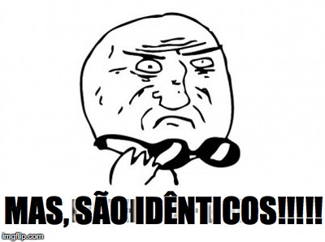

% O isomorfismo de Curry-Howard
% Ou sobre a similaridade entre provas e programas.
% Rodrigo Ribeiro

# Logic side: Dedução natural

$$
\Large{
\begin{array}{ccc}
    \dfrac{A \in \Gamma}{\Gamma \vdash A}
	& \hspace{1cm} &
	\dfrac{\Gamma \vdash A \to B\,\,\,\,\,\,\,\Gamma\vdash A}
             {\Gamma \vdash B} \\ \\
    \dfrac{\Gamma \cup \{A\}\vdash B}
              {\Gamma \vdash A \to B} & &
    \dfrac{\Gamma\vdash A\,\,\,\,\,\,\,\Gamma\vdash B}
              {\Gamma \vdash A \land B} \\ \\
    \dfrac{\Gamma \vdash A \land B}
          	{\Gamma \vdash A} & &
    \dfrac{\Gamma \vdash A \land B}
		     {\Gamma \vdash B} 	
\end{array}}
$$

# Type theory side : $\lambda$-cálculo tipado simples

$$
\Large{
\begin{array}{ccc}
    \dfrac{\textcolor[rgb]{1,0,0}{x :}\:A \in \Gamma}{\Gamma \vdash \textcolor[rgb]{1,0,0}{x :}\:A}
	& \hspace{0.1cm} &
	\dfrac{\Gamma \vdash \textcolor[rgb]{1,0,0}{\lambda x. e :}\: A \to
	B\,\,\,\,\,\,\,\Gamma\vdash \textcolor[rgb]{1,0,0}{e' :}\: A}
             {\Gamma \vdash \textcolor[rgb]{1,0,0}{(e\:\:e') :}\: B} \\ \\
    \dfrac{\Gamma \cup \{\textcolor[rgb]{1,0,0}{x :}\: A\}\vdash \textcolor[rgb]{1,0,0}{e :}\: B}
              {\Gamma \vdash \textcolor[rgb]{1,0,0}{\lambda x . e :}\: A \to B} & &
    \dfrac{\Gamma\vdash \textcolor[rgb]{1,0,0}{e :}\: A\,\,\,\,\,\,\,\Gamma\vdash \textcolor[rgb]{1,0,0}{e' :}\: B}
              {\Gamma \vdash \textcolor[rgb]{1,0,0}{(e ,e') :}\: A \times B} \\ \\
    \dfrac{\Gamma \vdash \textcolor[rgb]{1,0,0}{e :}\: A \times B}
          	{\Gamma \vdash \textcolor[rgb]{1,0,0}{fst\:\:e :}\: A} & &
    \dfrac{\Gamma \vdash \textcolor[rgb]{1,0,0}{e :}\: A \times B}
		     {\Gamma \vdash \textcolor[rgb]{1,0,0}{snd\:\:e :}\: B} 	
\end{array}}
$$

# Então você percebe...



# Uma outra visão da lógica.

- Lógica clássica: toda proposição é verdadeira ou falsa.
- Lógica intucionista: Uma proposição é verdadeira somente se esta
pode ser provada.
    * Mudança de paradigma: verdade sujeita a existência de evidência.
    * Lógica intuicionista é exatamente a lógica clássica sem o axioma
    do terceiro excluído e propriedades derivadas deste.
	* Ao contrário da lógica clássica, a semântica da lógica
      intuicionista é baseada na construção de provas, isto é, na
      dedução natural.

# O isomorfismo de Curry-Howard

- Provas em um dado subconjunto da matemática **correspondem** a programas em uma dada linguagem de programação
     * Descoberto por Curry em '58 e por Howard em '69.
     * Esse "isomorfismo" é também conhecido como "proof-as-programs" correspondence.
- Teoremas nada mais são que tipos e o programa correspondente a
    prova.
      * Para isso, sua linguagem de programação deve ser expressiva.
      * Não tente provar teoremas usando Java, C/C++, Python... :)

# The truth is out there...

\begin{table}
   \begin{tabular}{cc}
        Lógica                & Computação \\
        Provas                & Programas     \\
		Fórmulas            & Tipos  \\ \hline
		$A$ implica $B$ & função de $A$ em $B$ \\
		$A$ e $B$           & par formado por $A$ e $B$ \\
		$A$ ou $B$         & tagged union de $A$ e $B$ \\
		falso                   & tipo vazio \\
		verdadeiro          & tipo unit \\
		$\exists x. P(x)$ & um par formado por $x$ e um valor de tipo
		$P(x)$\\
		$\forall x \in A. P(x)$ & uma função de $x : A$ em $P(x)$.
   \end{tabular}
\end{table}


# The truth is out there...

- Não é só isso: provas por indução são funções recursivas!

- Teorema: Para todo $n \in \mathbb{N}$, existe $p\in\mathbb{N}$
tal que $n = 2p$ ou $n = 2p + 1$.

    * Caso $n = 0$. Imediato.
	* Caso $n = m + 1$. Pela I.H. temos que existe $p$ tal que
	  $m = 2p$ ou $m = 2p + 1$.
	     * Caso $m = 2p$: temos que $n = 2p + 1$.
	     * Caso $m = 2p + 1$: temos que $n = 2 (p + 1)$

# The truth is out there...

- Não é só isso: provas por indução são funções recursivas!

```haskell
div2 :: Int -> (Int, Bool)
div2 n
     | n == 0     = (0,True)
     | otherwise = if even then (p ,false)
	                        else (p + 1, true)
      	where
             (p,even) = div2 (n - 1)
````
